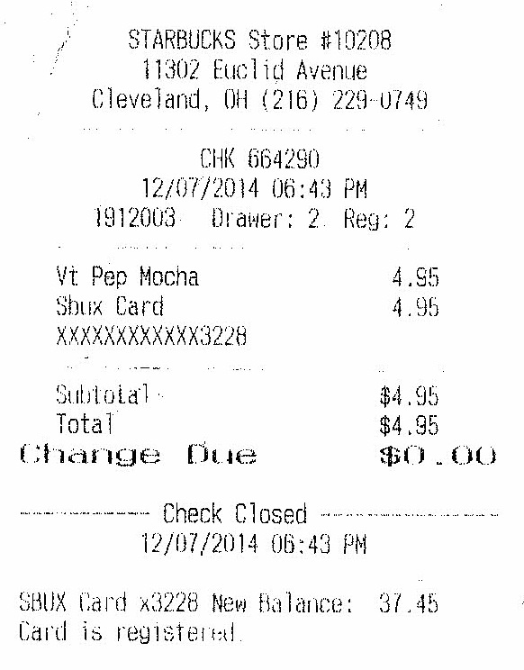
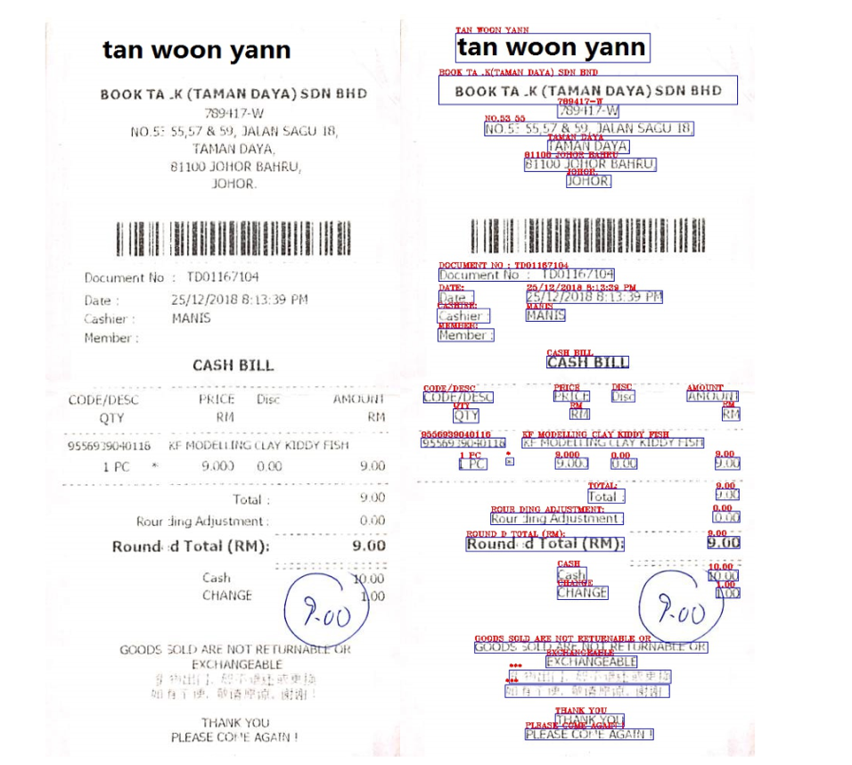

# ICDAR 2019 Robust Reading Challenge on Scanned Receipts OCR and Information Extraction

[](https://github.com/RichardLitt/standard-readme)

## Background

This repository is our team's solution of 2019 [ICDAR-SROIE](https://rrc.cvc.uab.es/?ch=13&com=introduction) competition. As the name suggests, this competition is mainly about Optical Character Recognition and information extraction:

> Scanned receipts OCR and information extraction (SROIE) play critical roles in streamlining document-intensive processes and office automation in many financial, accounting and taxation areas.

### Dataset and Annotations

The original dataset provided by ICDAR-SROIE has a few mistakes. This has been corrected by `scripts/check_data.py` and you can just use the `data` folder in this repo.

**Original dataset:** [Google Drive](https://drive.google.com/open?id=1ShItNWXyiY1tFDM5W02bceHuJjyeeJl2)/[Baidu NetDisk](https://pan.baidu.com/s/1a57eKCSq8SV8Njz8-jO4Ww#list/path=%2FSROIE2019&parentPath=%2F)

The dataset has 1000 whole scanned receipt images. Each receipt image contains around about four key text fields, such as goods name, unit price and total cost, etc. The text annotated in the dataset mainly consists of digits and English characters. An example scanned receipt is shown below:

<div align=center></div>

The dataset is split into a training/validation set (“trainval”) and a test set (“test”). The “trainval” set consists of 600 receipt images, the “test” set consists of 400 images.

For receipt OCR task, each image in the dataset is annotated with text bounding boxes (bbox) and the transcript of each text bbox. Locations are annotated as rectangles with four vertices, which are in clockwise order starting from the top. Annotations for an image are stored in a text file with the same file name. The annotation format is similar to that of ICDAR2015 dataset, which is shown below:

```
x1_1,y1_1,x2_1,y2_1,x3_1,y3_1,x4_1,y4_1,transcript_1

x1_2,y1_2,x2_2,y2_2,x3_2,y3_2,x4_2,y4_2,transcript_2

x1_3,y1_3,x2_3,y2_3,x3_3,y3_3,x4_3,y4_3,transcript_3

…
```

For the information extraction task, each image in the dataset is annotated with a text file with format shown below:

```json
{
  "company": "STARBUCKS STORE #10208",
  "address": "11302 EUCLID AVENUE, CLEVELAND, OH (216) 229-0749",
  "date": "14/03/2015",
  "total": "4.95"
}
```

### Tasks

The competition is divided into 3 tasks:

1. **Scanned Receipt Text Localisation**: The aim of this task is to accurately localize texts with 4 vertices.

2. **Scanned Receipt OCR**: The aim of this task is to accurately recognize the text in a receipt image. No localisation information is provided, or is required.

3. **Key Information Extraction from Scanned Receipts**: The aim of this task is to extract texts of a number of key fields from given receipts, and save the texts for each receipt image in a `json` file.

## Usage Guide

### Environment setup

We recommend conda as the package and environment manager. If you have conda available, you can use

```shell
(base)$ conda env create
```

and this will create a new conda environment named `sroie` on your computer, which will give you all the packages needed for this repo. Remember to activate the environment with

```shell
(base)$ conda activate sroie
```

### Tasks

This repository contains our trials and solutions of three tasks. Inside each folder there are documentations of the method we adopted and guide of usage.

- **Task 1 - Text Localization**: CTPN & SSD
- **Task 2 - Scanned Receipt OCR**: CRNN
- **Task 3 - Key Information Extraction**: Character-wise classification with Bi-LSTM

## Result

The result precision/recall/Hmean of our solution are listed as follows:

|  Task  | Recall | Precision | Hmean  | Evaluation Method |
| :----: | :----: | :-------: | :----: | :---------------- |
| Task 1 | 85.23% |  88.73%   | 86.94% | Deteval           |
| Task 2 | 26.33% |  72.53%   | 38.63% | OCR               |
| Task 3 | 75.58% |  75.58%   | 75.58% | /                 |

An visualisation of our solution:

<div align=center></div>
Here only the localisation and recognition are visualised. Eventually we decided to use CTPN for localisation and CRNN for OCR.

## License

```
Copyright (c) 2019 Niansong Zhang, Songyi Yang, Shengjie Xiu

Permission is hereby granted, free of charge, to any person obtaining a copy
of this software and associated documentation files (the "Software"), to deal
in the Software without restriction, including without limitation the rights
to use, copy, modify, merge, publish, distribute, sublicense, and/or sell
copies of the Software, and to permit persons to whom the Software is
furnished to do so, subject to the following conditions:

The above copyright notice and this permission notice shall be included in all
copies or substantial portions of the Software.

THE SOFTWARE IS PROVIDED "AS IS", WITHOUT WARRANTY OF ANY KIND, EXPRESS OR
IMPLIED, INCLUDING BUT NOT LIMITED TO THE WARRANTIES OF MERCHANTABILITY,
FITNESS FOR A PARTICULAR PURPOSE AND NONINFRINGEMENT. IN NO EVENT SHALL THE
AUTHORS OR COPYRIGHT HOLDERS BE LIABLE FOR ANY CLAIM, DAMAGES OR OTHER
LIABILITY, WHETHER IN AN ACTION OF CONTRACT, TORT OR OTHERWISE, ARISING FROM,
OUT OF OR IN CONNECTION WITH THE SOFTWARE OR THE USE OR OTHER DEALINGS IN THE
SOFTWARE.
```
