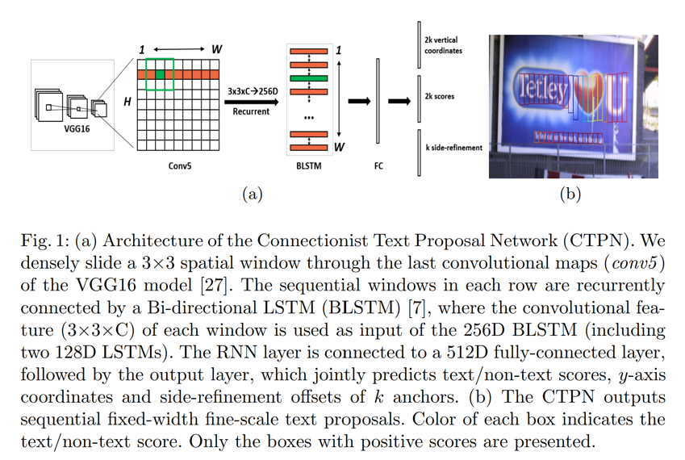

# Connectionist Text Proposal Network

This is a tensorflow implementation of [CTPN](https://arxiv.org/abs/1609.03605) by @tianzhi0549 and @varun-suresh. Many thanks to their great work and pre-trained models, and the original repository can be found [here](https://github.com/tianzhi0549/CTPN.git). More detail of set-up and training process can be found in their [documentation](https://github.com/tianzhi0549/CTPN/blob/master/README.md). Here we document how we used this work to solve task 1.

## Introduction

A novel Connectionist Text Proposal Network (CTPN) published by Tian, Zhi, et al. is deployed in this model. The CTPN model develops a vertical anchor mechanism for character detection whose result is refined to generate an accurate bounding box prediction.

<div align=center></div>

Most state-of-art algorithms are based on the bounding box regression or character-level feature extraction. However, this method combines the character-level bounding box regression with label prediction. A CNN is naturally used as a feature extractor, whose output is divided and fed into a bi-directional LSTM and fully -connected layer for anchor prediction and label classification. The end-to-end trainable model works with the various scale of texts even with some extremely ambiguous text.

It achieves 0.88 and 0.61 F-measure on ICDAR 2013 and 2015 benchmarks, according to the [original paper](https://arxiv.org/abs/1609.03605).

## Requirements
- tqdm==4.11.2
- opencv-python==3.4.0.12
- Shapely==1.6.4.post1
- matplotlib==1.5.3
- numpy==1.14.2
- tensorflow-gpu==1.4.0
- Cython==0.24.1
- ipython==5.1.0

## Install
The utilities of this project, non-maximum suppression `nms` and bounding box `bbox` are written in cython, which needs to be built first:
```shell
cd utils/bbox
chmod +x make.sh
./make.sh
```
It will generate a `nms.so` and a `bbox.so` in current folder.

## Prediction
1.  Build utilities as mentioned in `Install` part
2. Download the ckpt file from [google drive](https://drive.google.com/file/d/1HcZuB_MHqsKhKEKpfF1pEU85CYy4OlWO/view?usp=sharing) or [baidu yun](https://pan.baidu.com/s/1BNHt_9fiqRPGmEXPaxaFXw)
3. Put checkpoints_mlt/ in text-detection-ctpn/
4. Put images to predict in `data/demo/`, the results will be saved in `data/res/`, and run demo in the root directory 

```shell
python ./main/demo.py
```
5. The output result would be at `data/res/`. An example output is under this path, whose names are `X00016469670.jpg` and `X00016469670.txt`:
```
128,34,416,34,416,83,128,83,0.9997409
160,273,384,273,384,293,160,293,0.9997304
32,512,256,512,256,533,32,533,0.99972934
192,384,352,384,352,405,192,405,0.99971515
...
```
here we cacelled the visualization of text box, and changed the output file format to that can be directly used in Task 2.

## Training
### Prepare data
1.  Download the pre-trained model of VGG net and put it in `data/vgg_16.ckpt`. You can download it from [tensorflow/models](https://github.com/tensorflow/models/tree/1af55e018eebce03fb61bba9959a04672536107d/research/slim)

2. Download the ICDAR data from [google drive](https://rrc.cvc.uab.es/?com=downloads&action=download&ch=&f=aHR0cHM6Ly9kcml2ZS5nb29nbGUuY29tL29wZW4/aWQ9MVNoSXROV1h5aVkxdEZETTVXMDJiY2VIdUpqeWVlSmwy) or [baidu pan](https://rrc.cvc.uab.es/?com=downloads&action=download&ch=&f=aHR0cHM6Ly9wYW4uYmFpZHUuY29tL3MvMWE1N2VLQ1NxOFNWOE5qejgtak80V3cjbGlzdC9wYXRoPSUyRlNST0lFMjAxOSZwYXJlbnRQYXRoPSUyRg==). Extract images and label files from `task1train.zip` to `data/dataset/original`

3. In `data/dataset/`, we prepared a python script to convert dataset to desired format and path. Just run:
```shell
cd data/dataset/
python prepare_dataset.py
```
the images and labels will be put under `data/dataset/mlt` folder, which will be used by the data loader as training dataset.

### Training
Simply run:
```shell
python ./main/train.py
```