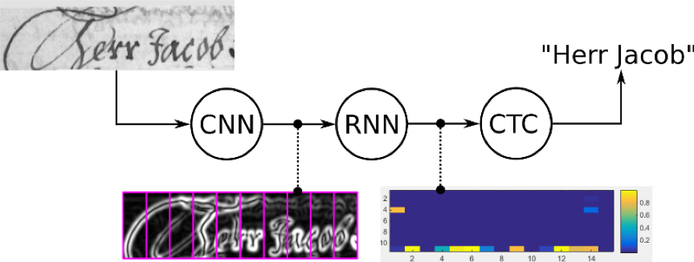
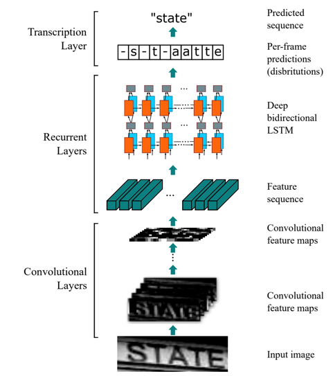

# Scanned Receipt OCR by Convolutional-Recurrent Neural Network

This is a `pytorch` implementation of CRNN, which is based on @meijieru's repository [here](https://github.com/meijieru/crnn.pytorch).

## Introduction

