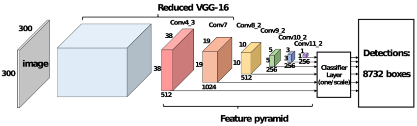
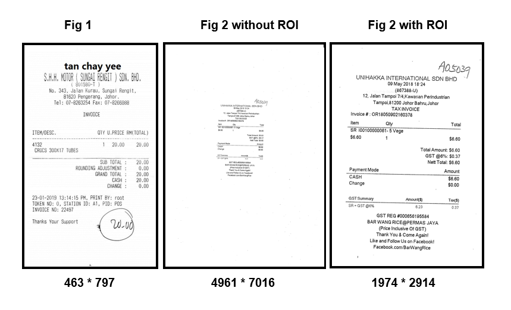
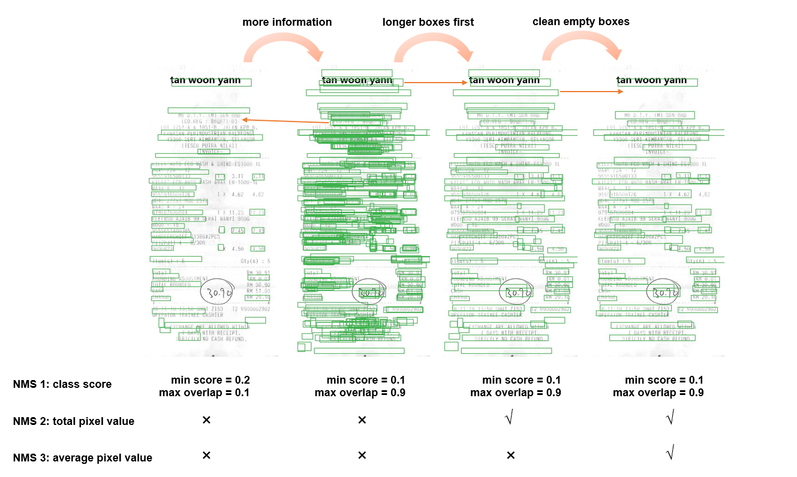
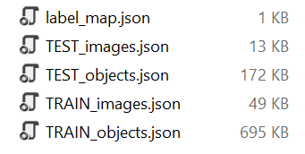

# ICDAR-SROIE-Task1-SSD

This excellent work is by @Michael.Xiu, my team-mate. His original repository could be found [here](https://github.com/Michael-Xiu/ICDAR-SROIE).

This code is based on [SSD PyTorch tutorial](https://github.com/sgrvinod/a-PyTorch-Tutorial-to-Object-Detection) for our specific task. Thank ***Sagar Vinodababu*** for permission and support.

## Our Target

Download the ICDAR-SROIE dataset:
- [2019 _ICDAR-SROIE_](https://pan.baidu.com/s/1a57eKCSq8SV8Njz8-jO4Ww#list/path=%2FSROIE2019&parentPath=%2F) (542MB)

## Our model
- **Task 1 - Scanned Receipt Text Localisation**

We use *SSD300* as our backbone. Since in OCR task, there is only one label class \[*text*\], we classify our boxes into two classes \[*background*, *text*\]. We split our training set into a training set and a testing set. 

Run [`boxing.py`] and we can see the goal of this task

There are several tricks with SSD in OCR:

**1. Tackle the scale variation with ROI finding**. 

Since the scanned receipts have varied resolutions and SSD requires a limited input size *300\*300*, we find the ROI of each receipt to help focus on the content.

**2. Improve the Non-Maximum Suppression**. 

With only the traditional NMS (NMS 1), if we want to have an accurate but clean result, we have only two hyperparameters [*min score*, *max_overlap*] to enhance performance. If we set *min score* higher, then many correct boxes will be suppressed because the confidence of correct classification is not so high expecially for testing images. If we set *min score* lower, then lots of empty boxes will come in and they are stubborn. As for *max overlap*, we tend to lower it for clear segementation. However, it omits our goal that we want to pretain longer boxes instead of shorter ones. It is possible that the box containing only a part of the words group, having higher confidence, will suppress the longer boxes with lower confidence. 

In this case, we add two more NMS based on our statistic: For a specific words group, longer boxes with more words have higher sum of pixel values then shorter boxes with less words. Compared with boxes with content, boxes without content have higher pixel value average since the background is white.

## Code Hierarchy
- `split_train_test.py` : Split raw images and '.txt' into a training set and a testing set.
- `create_data_lists.py` -> `utils.crete_data_lists()` -> `utils.parse_annotation()` :  Create '.json' files to store ID of images, objects {boxes & labels & texts} and labels (num of classes) . 
- `train.py` : Define the main procedure of training.
  - `train.py` -> `datasets.ICDARDataset()` : Read '.json' files to get datasets, apply data preprocessing with `utils.transform()` and store in a Dataset class to be used in a PyTorch DataLoader to create batches.
  - `train.py` -> `model.py` : Define SSD model and its MultiBox loss function.
- `detect.py` : Define the main procedure of testing (single arbitrary image), including data preprocessing and annotation.
  - `detect.py` -> `model.py` : Define SSD model and `detect_objects()` function with non-maximum suppression.
- `eval.py`:Define the main procedure of evaluation (predefined testing dataLoader).
  - `eval.py` -> `model.py` : Define SSD model and `detect_objects()` function with non-maximum suppression.
  - `eval.py` -> `utils.calc_f1()` : Calculate F1 score.
  

## Prepare Data for training

### Train/Test Data Split 
Open [`split_train_test.py`] and set **train_test_ratio**. In this case it is set to 4.

In `.\ICDAR_Dataset` two files `train1` and `test1` are created. Images and labels are split into these two files in sequence.

### Pack Data
Run [`create_data_lists.py`] in order to pack all the image paths, objects and labels into json files for futher operations. These json files are named `TEST_images.json` `TEST_objects.json` `label_map.json` `TRAIN_images.json` `TRAIN_objects.json`.

### Train
Run [`train.py`] to train an end-to-end text detection model. In this case we use Adam as optimizer.

### Detect
Run [`detect.py`] to detect an test image with pretrained model with minimum validation loss. 

### Eval
Run [`eval.py`] to evaluate the performance of the model based on F1 scores.
